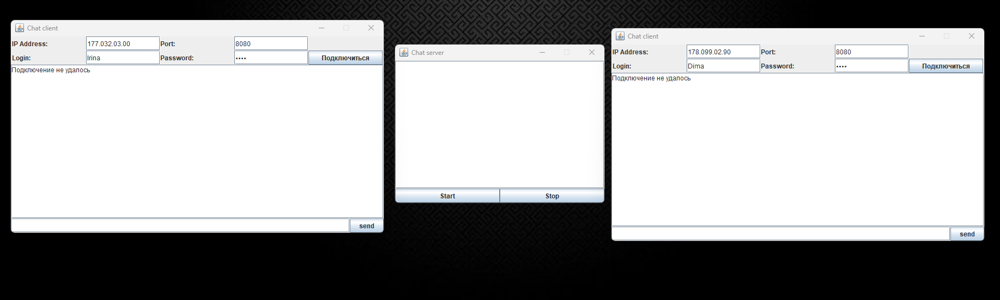
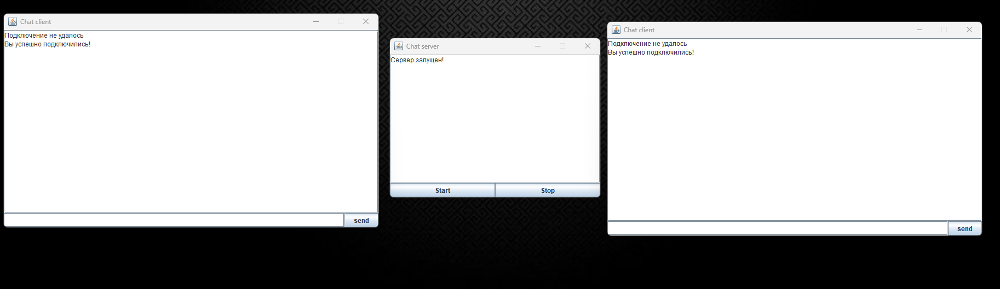
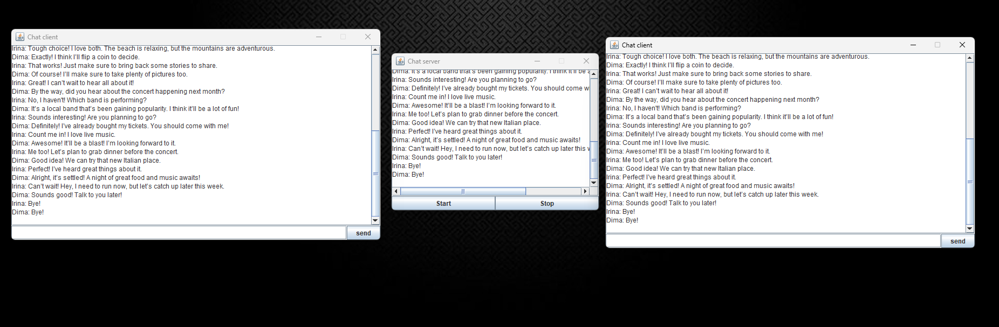
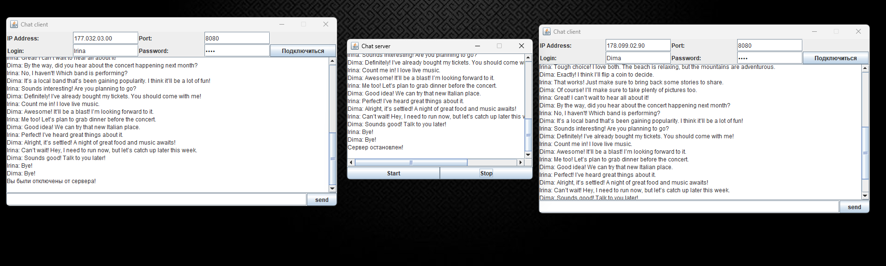
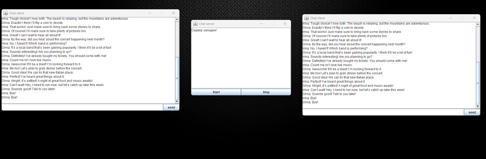

# Client server application
# Класс ServerWindow

Класс ServerWindow представляет собой графический интерфейс (GUI) для простого приложения чат-сервера. 
Он разработан с использованием Java Swing и управляет подключениями пользователей, ведением журнала 
сообщений и управлением работой сервера (запуск/остановка).

## Основные функции

- Управление пользователями:
    - Позволяет клиентам (экземпляры ClientGUI) подключаться и отключаться от сервера.
    - Содержит список подключенных клиентов.

- Обработка сообщений:
    - Принимает сообщения от подключенных клиентов и передает их всем клиентам.
    - Ведет журнал сообщений в текстовом файле для сохранения истории.

- Управление сервером:
    - Кнопки для запуска и остановки сервера.
    - Отображает статус сервера и сообщения в текстовой области.

- Ведение журнала чата:
    - Сохраняет историю чата в текстовом файле (logChat.txt) для последующего просмотра.
    - Читает журнал из файла, чтобы отображать прошлые сообщения в GUI.

## Структура класса

### Константы
- WIDTH и HEIGHT: Определяют размеры окна сервера.
- LOG_PATH: Путь к файлу для сохранения журналов чата.

### Атрибуты
- clientGUIList: Список, содержащий активные экземпляры GUI клиента.
- btnStart и btnStop: Кнопки для управления работой сервера.
- log: JTextArea для отображения сообщений и журналов.
- work: Булевый флаг, указывающий, активен ли сервер.

### Конструктор
- ServerWindow(): Инициализирует окно сервера, настраивает элементы GUI и делает окно видимым.

### Методы
- connectUser(ClientGUI clientGUI): Добавляет клиента к серверу, если он работает.
- getLog(): Извлекает журнал чата из файла.
- disconnectUser(ClientGUI clientGUI): Отключает клиента от сервера.
- message(String text): Обрабатывает входящие сообщения, обновляет клиентов 
и записывает сообщения в журнал.
- answerAll(String text): Отправляет сообщения всем подключенным клиентам.
- saveInLog(String text): Сохраняет полученные сообщения в файл журнала.
- readLog(): Читает журнал чата из файла и возвращает его в виде строки.
- appendLog(String text): Добавляет сообщения в JTextArea для отображения.
- createPanel(): Настраивает основную панель GUI.
- createButtons(): Создает и настраивает кнопки запуска и остановки.

### Пользовательский интерфейс
GUI состоит из:
- JTextArea для отображения сообщений и журналов.
- JPanel, содержащий две кнопки для запуска и остановки сервера.

# Класс ClientGUI

Класс ClientGUI представляет собой графический пользовательский интерфейс (GUI) для клиентской части 
chat-приложения. Он взаимодействует с сервером (ServerWindow), позволяя пользователям подключаться к нему,
отправлять и получать сообщения.

## Основные функции

- Подключение к серверу:
  - Пользователь может ввести IP-адрес и порт сервера для подключения.
  - Обрабатывает успешное и неудачное подключение к серверу.

- Отправка и получение сообщений:
  - Позволяет пользователю отправлять сообщения, которые будут переданы серверу.
  - Получает и отображает сообщения от других пользователей.

- История чата:
  - Ведет журнал чата в текстовой области, в которую записываются все отправленные и полученные сообщения.

## Структура класса

### Константы
- WIDTH и HEIGHT: Определяют размеры окна клиента.

### Атрибуты
- server: Ссылка на экземпляр ServerWindow, к которому подключается клиент.
- connected: Булевый флаг, показывающий, подключен ли клиент к серверу.
- name: Имя пользователя для идентификации в чате.

- log: JTextArea для отображения сообщений чата.
- tfIPAddress: Поле для ввода IP-адреса сервера.
- tfPort: Поле для ввода порта сервера.
- tfLogin: Поле для ввода имени пользователя.
- tfMessage: Поле для ввода сообщения.
- password: Поле для ввода пароля (не используется в данном коде).
- btnLogin: Кнопка для подключения к серверу.
- btnSend: Кнопка для отправки сообщения.
- headerPanel: Панель для ввода данных для подключения.

### Конструктор
- ClientGUI(ServerWindow server): Инициализирует окно клиента, настраивает элементы GUI 
и позиционирует его относительно сервера.

### Методы
- answer(String text): Добавляет текст в журнал сообщений.
- connectToServer(): Подключает клиента к серверу и обновляет интерфейс.
- disconnectFromServer(): Отключает клиента от сервера.
- message(): Отправляет введенное сообщение на сервер.
- appendLog(String text): Добавляет текст в текстовую область для отображения сообщений.
- createPanel(): Настраивает основные панели интерфейса клиента.
- createHeaderPanel(): Создает панель заголовка для ввода данных о подключении.
- createLog(): Создает текстовую область для отображения сообщений.
- createFooter(): Создает панель для ввода сообщения и кнопки отправки.

### Пользовательский интерфейс
GUI состоит из:
- Панели заголовка (headerPanel), в которой пользователь вводит IP-адрес, порт, логин и пароль.
- JTextArea для отображения всех сообщений чата.
- Панели внизу для ввода сообщения и кнопки для его отправки.

# Класс Main

Класс Main является точкой входа для запуска чат-приложения, состоящего из сервера и клиентской части. 
Он отвечает за инициализацию сервера и создание клиентов, которые могут подключаться к нему.

### Пример запуска программы:
- Без подключения к серверу

- Сервер подключен

- Пример переписки пользователей

- Сервер остановлен

- При повторном запуске приложения

